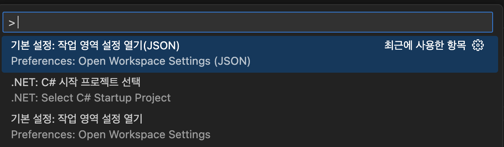
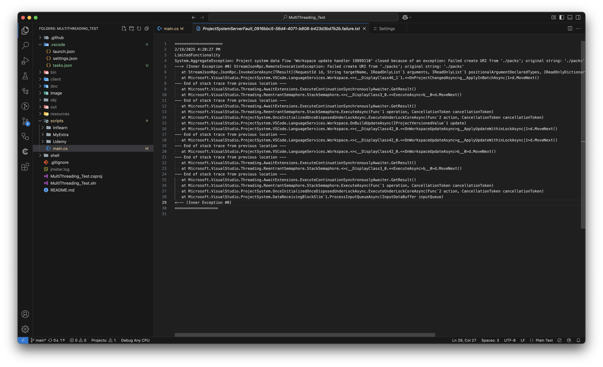
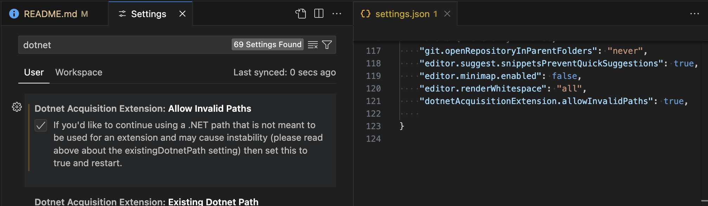
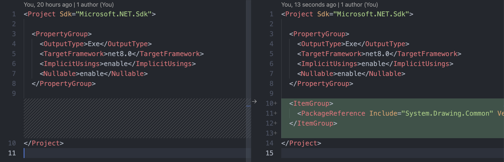
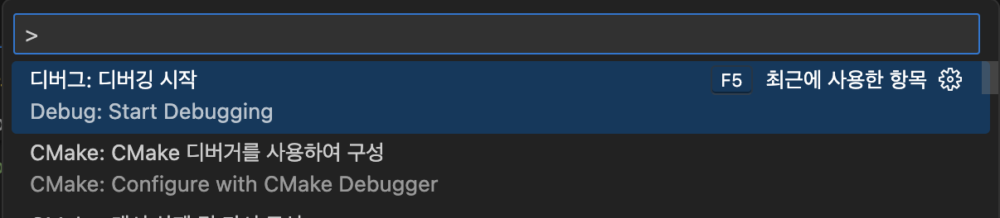
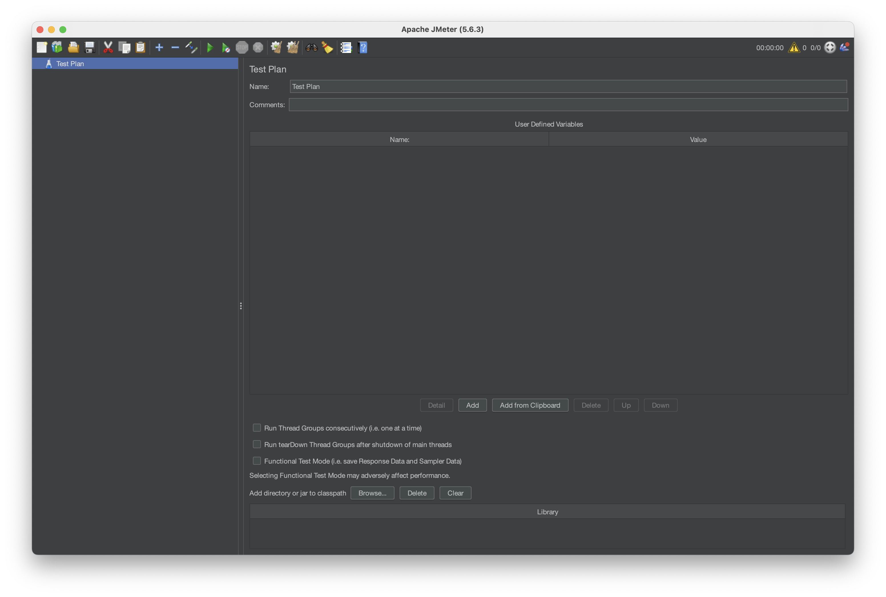

# Udemy 멀티스레드 강좌 공부 노트

#### 다음 강좌를 C#으로 제작

1. #### [Udemy : Java 멀티스레딩, 병행성 및 성능 최적화 - 전문가 되기](https://www.udemy.com/course/java-multi-threading/?couponCode=KEEPLEARNING)
2. #### [Inflearn : Backend 멀티쓰레드 이해하고 통찰력 키우기 ⭐️추가⭐️](https://inf.run/JAtvq) 
    *C#언어로 강의를 진행하고, 다양한 멀티 스레딩 패턴과, CPU 구조 등등 정말 유용한 강의!*

#### 도움을 얻은 블로그와 유튜브

1. [위키독스 : 프로세스와 스레드](https://wikidocs.net/231731)
2. [널널한 개발자 : 프로세스와 스레드](https://www.youtube.com/watch?v=x-Lp-h_pf9Q&ab_channel=%EB%84%90%EB%84%90%ED%95%9C%EA%B0%9C%EB%B0%9C%EC%9E%90TV)
3. [쉬운코드 : 동기&비동기](https://www.youtube.com/watch?v=EJNBLD3X2yg&ab_channel=%EC%89%AC%EC%9A%B4%EC%BD%94%EB%93%9C)
4. [에로로 : 비동기 프로그래밍 & 병렬 처리](https://blog.naver.com/vactorman/80167386667)
5. [예제로 배우는 C# 프로그래밍 : 멀티 쓰레딩](https://www.csharpstudy.com/Threads/async-delegate.aspx)
6. [jacking75 : 데이터 병렬처리 & 작업기반 비동기 프로그램 문법](https://jacking75.github.io/csharp_TPL/)
   * [jacking75 : 유튜브](https://www.youtube.com/user/jacking75)
7. [모꾼 TV : Multi Thread 배우고 통찰력 높이기](https://www.youtube.com/watch?v=jbH2HRuot_Y&list=PLR24aVs517wgs8uL1UawG8CgHQWYMx202)

---

> ### 1. [Vscode 솔루션 파일 제작](https://stackoverflow.com/questions/36343223/create-c-sharp-sln-file-with-visual-studio-code)

```shell
dotnet new console
```

---

> ### 2. vscode IntelliCode

* 솔루션 파일만 제작했다 하더라도 인텔리 센스가 작동 안할 때가 있다.
* 그럴때는 폴더 구조가 루트 디렉토리에 `.vscode` 폴더 만들고, setting.json 파일을 만들어야 한다.
  ```
    ROOT
      ├── .vscode
      │   └── settings.json
      └── UdemyMultiThreading
          └── MultiThreading_Test
            ├── MultiThreading_Test.csproj
            ├── MultiThreading_Test.sln
            ├── README.md
            ├── doc
            ├── img
            ├── resources
            └── scripts
              ├── Lecture1_Program.cs
              ├── Lecture2_FactorialProgram.cs
              ├── Lecture3_HTTPProgram.cs
              ├── Lecture3_ImageProgram.cs
              └── main.cs
  ```
* Preferences: Open Workspace Settings (JSON)
  
  ```json
  /* setting.json */
  {
    "dotnet.defaultSolution": "TestConsole.sln"
  }
  ```

* 이번에는 "Failed create URI from './packs'; original string: './packs'." 발생
  
  1. **[Dotnet Install Tool Extension 세팅](https://github.com/microsoft/vscode-dotnettools/issues/1763)**
    
  2. **[.NET 9.0이 2월 11일에 나와서 거짓말 같이 내려받으니 괜찮아진 것 같다.](https://dotnet.microsoft.com/ko-kr/download)**

---

> ### 3. NuGet 패키지 관리



1. ##### 터미널로 패키지관리
   * VS Code에서 내장 터미널을 열고(Ctrl+`` 또는 Cmd+`` on macOS), 프로젝트 디렉토리로 이동
   * dotnet add package [패키지 이름] 명령어를 사용하여 NuGet 패키지를 프로젝트에 추가.
     * *예를 들어, Newtonsoft.Json 패키지를 추가하려면 dotnet add package Newtonsoft.Json 명령을 사용*
 
2. ##### NuGet 으로 확장 기능 사용
   * VS Code NuGet 패키지를 검색
   * NuGet Package Manager 확장 기능을 설치시 VS Code 내에서 직접 NuGet 패키지를 검색하고 설치할 수 있음
   * 커맨드 팔레트(Ctrl+Shift+P 또는 Cmd+Shift+P on macOS)를 열고 해당 확장 기능의 명령을 사용하여 패키지를 관리할 수 있습니다.

---

> ### 4. 프로젝트 빌드 및 실행

1. ##### 빌드
   * NuGet 패키지를 프로젝트에 추가한 후, 
   * 터미널에서 `dotnet build` 명령을 실행하여 프로젝트를 빌드

2. ##### 프로젝트 실행
   * dotnet run 명령을 실행하여 프로젝트를 실행할 수 있습니다.
      ```shell
      cd MultiThreading_Test
      dotnet run
      ```
3. ##### 디버깅
   * 빌드 바이너리 디렉토리에 리소스가 경로를 못찾아오는 문제가 있었다.
     1. csproj 리소스와 결과디렉토리를 명시한다 *빌드시, 디렉토리 복사*
          ```xml
          <ItemGroup>
            <PackageReference Include="SixLabors.ImageSharp" Version="3.1.5" />
            <!-- 
              여기서 부터 Content하고 include 하고 감싸준다.
            --> 
            <Content Include="resources/*.*">
              <CopyToOutputDirectory>Always</CopyToOutputDirectory>
            </Content>
            <Content Include="out/*.*">
              <CopyToOutputDirectory>Always</CopyToOutputDirectory>
            </Content>
          </ItemGroup>
          ```
     2. launch.json도 수정하자
        ```json
        "configurations": [
          {
            "name": "C#: Multi Thread Main Debug",
            "type": "dotnet",
            "request": "launch",
            "program": "${workspaceFolder}/bin/Debug/net8.0/MultiThreading_Test.dll",
            "projectPath": "${workspaceFolder}/MultiThreading_Test.csproj",
            "args": [],
            "cwd": "${workspaceFolder}",
            "stopAtEntry": false,
            "console": "internalConsole",
          }
        ]
        ```
     3. 

---

> ### 5. HTTP 서버 Throughput 측정을 위한 Apache JMeter 설치

1. **M1에서 Apache JMeter 설치**
     ```bash
     arch -x86_64 brew install jmeter
     ```
2. **환경 변수 설정**
     ```shell
     /*** ~/.zshrc ***/
     export PATH="/opt/homebrew/bin/jmeter/:$PATH"
     ```
3. **터미널에서 `> jmeter` 수행**


---

> ### 6. 추가한 패키지

* #### [SixLabors.ImageSharp](https://docs.sixlabors.com/index.html)
  * System.Drawing.Common은 Apple M1에서 지원하지 않아, SixLabors.ImageSharp을 사용

* #### [Microsoft.Extensions.ObjectPool](https://www.nuget.org/packages/microsoft.extensions.objectpool/)
* #### [Newtonsoft.Json](https://www.nuget.org/packages/newtonsoft.json/)