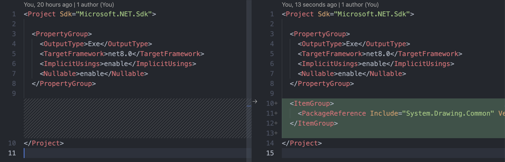

# Udemy 멀티스레드 강좌 공부 노트
> #### [Udemy : Java 멀티스레딩, 병행성 및 성능 최적화 - 전문가 되기](https://www.udemy.com/course/java-multi-threading/?couponCode=KEEPLEARNING)
다음 강좌를 C#으로 제작


[SixLabors.ImageSharp](https://docs.sixlabors.com/index.html)
* System.Drawing.Common은 Apple M1에서 지원하지 않아, SixLabors.ImageSharp을 사용

### 실행

```shell
cd MultiThreading_Test
dotnet run
```

### 참조

[Vscode 솔루션 파일 제작](https://stackoverflow.com/questions/36343223/create-c-sharp-sln-file-with-visual-studio-code)

```shell
dotnet new console
```




```
NuGet 패키지 관리:

터미널을 사용하는 방법: VS Code에서 내장 터미널을 열고(Ctrl+`` 또는 Cmd+`` on macOS), 프로젝트 디렉토리로 이동한 다음, dotnet add package [패키지 이름] 명령어를 사용하여 NuGet 패키지를 프로젝트에 추가할 수 있습니다. 예를 들어, Newtonsoft.Json 패키지를 추가하려면 dotnet add package Newtonsoft.Json 명령을 사용합니다.

NuGet 패키지 관리 확장 기능 사용: VS Code 마켓플레이스에서는 NuGet 패키지를 검색하고 관리할 수 있는 다양한 확장 기능을 제공합니다. 예를 들어, NuGet Package Manager 확장 기능을 설치하면, VS Code 내에서 직접 NuGet 패키지를 검색하고 설치할 수 있습니다. 확장 기능을 설치한 후, 커맨드 팔레트(Ctrl+Shift+P 또는 Cmd+Shift+P on macOS)를 열고 해당 확장 기능의 명령을 사용하여 패키지를 관리할 수 있습니다.

프로젝트 빌드 및 실행: NuGet 패키지를 프로젝트에 추가한 후, 터미널에서 dotnet build 명령을 실행하여 프로젝트를 빌드하고, dotnet run 명령을 실행하여 프로젝트를 실행할 수 있습니다.
```
